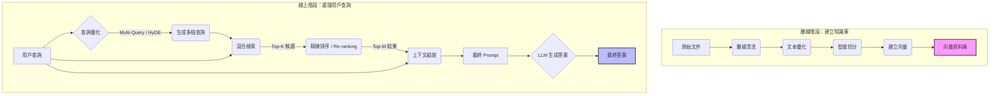

# WSM RAG 專案評估指南

本專案使用 `docker-compose` 建立一個可攜式、自包含的 RAG（Retrieval-Augmented Generation）評估環境。它包含兩個服務：
1.  **`app`**：執行主要 RAG 程式 (`My_RAG`) 和評估工具 (`rageval`) 的 Python 服務。
2.  **`ollama`**：一個專門用來跑「裁判模型 (Judge LLM)」的服務，`rageval` 會呼叫它來為 RAG 答案評分。

使用 `docker-compose` 可以確保所有協作者都有一致的執行環境，無需在本機手動安裝 Ollama 或處理複雜的網路設定。

## 執行需求 (Prerequisites)

* [Docker Desktop](https://www.docker.com/products/docker-desktop/)
* 一台有 **NVIDIA GPU** 的主機 (本專案已針對 6GB VRAM 進行優化)
* 確保 Docker Desktop 已設定使用 NVIDIA GPU (通常是預設)

## ⚡ 如何執行 (How to Run)

**只需要這一個指令。**

在專案的根目錄 (包含 `docker-compose.yml` 的地方)，打開你的終端機 (PowerShell / Terminal) 並執行：

```bash
docker-compose up --build
```

### 第一次執行會發生什麼？

1.  **Build Services:** `docker-compose` 會使用 `Dockerfile` 和 `ollama_service/Dockerfile` 分別建立 `app` 和 `ollama_service` 的映像。這個過程現在非常快，因為模型不會在 build 階段下載。
2.  **Start Services:** 啟動 `ollama_service` 和 `app` 兩個 container。
3.  **Run `entrypoint.sh` & Download Model:**
    *   `ollama_service` 容器啟動後，會執行 `entrypoint.sh` 腳本。
    *   此腳本會先啟動 Ollama 伺服器，然後**自動下載 `gemma:2b` 模型** (約 2.5GB)。
    *   模型會被下載到 `ollama_storage` 這個 Volume 中，這意味著**未來再啟動就無需重新下載**。
    *   **(請在此時保持耐心，這只需要一次)**
4.  **Run `run.sh`:** 當 `ollama_service` 準備就緒後，`app` 服務會自動開始執行 `run.sh` 腳本 (包含 RAG 預測和評估)。
5.  **Run Evaluation:** `ollama_service` 會將模型載入 VRAM，`rageval` 的評估進度條就會開始跑了。

### 未來執行

1. **重新跑一次評估 (無修改程式碼):**
   ```bash
   docker-compose up
   ```

2. **重新建置並執行 (有修改程式碼):**
   ```bash
   docker-compose up --build --force-recreate
   ```

3. **跑完自動關閉並清除所有服務:**
   ```bash
   docker-compose up --build --force-recreate --abort-on-container-exit
   ```

4. **手動獨立執行評分 (Manual Evaluation):**
   如果你只想對現有的 `predictions/` 結果重新進行評分 (使用 `rageval`)，而不想重跑整個 RAG 生成過程，可以進入容器或在本地環境執行：
   ```bash
   bash rageval/evaluation/run_evaluation.sh
   ```
   這會讀取 `predictions/*.jsonl`，使用 `granite4:3b` 重新計算分數，並將結果輸出至 `results/final_result.json`。
   > **注意：** 評分需要 `ground_truth` 欄位。如果您的預測檔案中缺少此欄位 (例如 Test Set)，該筆資料將會被自動跳過不計分。


## 🧹 如何停止與清理

1.  **停止服務：** 在 `docker-compose up` 正在運行的終端機中，按下 `Ctrl + C`。
2.  **停止並移除 Container：** (如果服務是在背景 `-d` 執行，或你想徹底清理)
    ```bash
    docker-compose down
    ```
3.  **移除 Ollama 模型快取 (非必要)：** 如果你想刪除下載的 `gemma:2b` 模型，執行：
    ```bash
    docker-compose down -v
    ```
    (`-v` 會連同 `ollama_storage` volume 一起刪除)

## 🚀 優化 (Optimization)

### lixiang1201_2323_optimize-rag-performance

**目標：** 優化 Ollama 客戶端 (Client) 的實例化，以提高 RAG 管道的整體執行效能。

**改動內容：**

1.  **`My_RAG/main.py` (修改):**
    *   將 `ollama.Client` 的實例化邏輯和主機備援 (fallback) 邏輯從 `My_RAG/generator.py` 移至 `main.py`。
    *   此邏輯現在位於查詢處理迴圈之前，確保 `ollama.Client` 物件只會被建立一次。
    *   在 `main.py` 中，新增了 `ollama.Client` 和 `os` 的 import。
    *   `generate_answer` 函式的呼叫現在會傳遞這個已經實例化好的 `ollama_client` 物件。
    *   新增了連線失敗時的錯誤處理，如果所有主機都無法連線，會拋出 `ConnectionError`。

2.  **`My_RAG/generator.py` (修改):**
    *   移除了 `from ollama import Client` 的 import (因為 client 會從 `main.py` 傳入)。
    *   修改了 `generate_answer` 函式的簽名 (signature)，使其接受一個 `ollama_client` 物件作為參數。
    *   移除了函式內部重複建立 `ollama.Client` 物件和主機備援的邏輯。
    *   直接使用傳入的 `ollama_client` 物件來進行 `generate` 操作。

**優化效益：**
*   避免了在每個查詢中重複實例化 `ollama.Client` 物件和執行連線檢查，大幅減少了不必要的開銷。
*   提高了 RAG 管道在處理大量查詢時的執行效率。

### esdese-feature-1
**目標：** 引入混合檢索 (Hybrid Retrieval) 與重排序 (Reranking) 機制，提升檢索準確度。

**改動內容：**

1.  **Hybrid Retrieval (混合檢索):**
    *   結合 **BM25** (關鍵字檢索) 與 **Embedding Similarity** (向量語意檢索)。
    *   使用 `ollama` 的 embedding 模型 (或 `SentenceTransformer`) 生成文件與查詢的向量。
    *   透過加權平均 (`alpha` 參數) 合併兩者的分數，兼顧精確匹配與語意理解。

2.  **LLM Reranker (重排序):**
    *   在初步檢索出候選文件後，使用 LLM (如 `granite4:3b`) 對候選文件進行再一次的相關性評分。
    *   根據 LLM 的評分對結果進行重新排序，將最相關的文件排在最前面。

3.  **整合優化:**
    *   將上述功能整合進 `My_RAG/retriever.py`。
    *   配合 `lixiang1201_2323_optimize-rag-performance` 的優化，重用 `main.py` 中建立的單一 `ollama.Client` 實例，避免重複連線開銷。

### uuuu
**目標：** 吸收 `uuuu` 分支的優化項目，包含智能文件切分與精細提示工程。

**改動內容：**

1.  **智能文件切分 (`My_RAG/chunker.py`):**
    *   引入了基於句子邊界的切分方法，取代了原有的固定長度切分。
    *   新方法會根據句號、換行符等標點符號來分割文本，確保每個文件區塊（chunk）的語意完整性，對提升檢索品質有正面幫助。

2.  **精細提示工程 (`My_RAG/generator.py`):**
    *   針對中、英文設計了更詳細、更具指導性的 Prompt。
    *   新的 Prompt 明確指示 LLM 必須嚴格根據上下文回答、仔細比對公司名稱與年份等實體，並完整包含所有關鍵資訊，以提高生成答案的忠實度和準確性。

3.  **流程整合 (`My_RAG/main.py`):**
    *   調整了 `main.py` 中的函式呼叫，以兼容新的 `generator.py`（傳遞 `language` 參數）。

### wang
**目標：** 吸收 `wang` 分支的優化項目，包含新的混合檢索策略、答案引用來源以及更精準的參考資料篩選。

**改動內容：**

1.  **兩階段混合檢索 (`My_RAG/retriever.py`):**
    *   引入了新的 `HybridBM25EmbeddingRetriever`。
    *   **策略：** 首先使用 BM25 從大量文件中快速篩選出 30 個候選，然後僅對這些候選文件計算向量，最後使用向量相似度進行精確的重排序（Re-ranking）。
    *   **效益：** 這是一種高效的兩階段檢索策略，兼顧了速度與準確性。
    *   **向量模型：** 中文使用 `qwen3-embedding:0.6b`，英文使用 `embeddinggemma:300m`。(註：`nomic-embed-text` 是另一個可能表現更好的英文模型，但需另外執行 `ollama pull nomic-embed-text` 下載)。

2.  **答案引用來源 (`My_RAG/generator.py`):**
    *   修改了 Prompt，要求 LLM 在生成答案後，必須明確標示出答案是參考了哪些上下文（例如 `Sources: [1], [3]`）。
    *   這項改動大幅提升了答案的可追溯性和可信度。

3.  **句子級參考資料 (`My_RAG/main.py`):**
    *   新增了 `_select_reference_sentences` 函式。
    *   它不再將整個文件區塊（chunk）作為參考資料，而是進一步從區塊中，挑選出與問題最相關的幾個**句子**作為最終的 `references`。
    *   這使得參考資料更為精準、簡潔。

### lixiang1202_optimize-rag-performance(1203)
**目標：** 進行實驗，驗證 `Multi-Query` 是否為導致效能不如預期的原因。

**實驗內容：**

1.  **假設：**
    *   `Multi-Query` 雖然能擴大召回範圍，但也可能引入不相關的「噪音」查詢，這些查詢檢索到的無關文件污染了最終的上下文，導致生成模型表現下降。

2.  **方法 (`My_RAG/main.py`):**
    *   暫時停用 `generate_multiple_queries` 函式。
    *   將檢索流程改回單次檢索模式，僅使用原始問題來呼叫 `retriever.retrieve`。

3.  **預期結果：**
    *   如果停用 `Multi-Query` 後分數**回升**，則證明假設成立，未來優化方向應為改善 `Multi-Query` 的查詢品質，或採用更智能的合併策略。
    *   如果分數**依然很差**，則表示問題可能出在「兩階段混合檢索」策略本身，它可能不如 `uuuu` 分支中那個更簡單的 BM25 檢索器適合此資料集。

### lixiang1202_optimize-rag-performance(1204)
**目標：** 進行兩階段實驗，首先驗證消融 `Multi-Query` 的影響，接著導入 `Stemming` 技術。

**實驗內容：**

1.  **消融 `Multi-Query` (`My_RAG/main.py`):**
    *   **目的：** 驗證禁用 `Multi-Query` 功能對檢索效能的影響。此實驗已在先前的版本中完成。
    *   **方法：** 暫時停用 `generate_multiple_queries` 函式，僅使用原始查詢進行檢索。

2.  **導入 `Stemming` 技術 (`My_RAG/retriever.py`):**
    *   **目的：** 透過詞幹提取，將英文單詞還原為其基本形式，以提高檢索的召回率，減少因詞形變化導致的匹配失敗。
    *   **方法：** (此步驟將在更新 README 後執行) 引入 `nltk` 函式庫，並在 `requirements.txt` 中新增相應的依賴。在索引建立和查詢時，使用 `PorterStemmer` 進行詞幹提取。

**綜合觀察：**
*   此版本旨在分離並評估 `Multi-Query` 和 `Stemming` 對 RAG 效能的獨立貢獻。

### esdese-feature-1(1205)
**目標：** 整合 `esdese-feature-1` 分支的優化，包括智能切分、混合檢索升級與 Chain-of-Thought (CoT) 生成。

**改動內容：**

1.  **智能切分 (`My_RAG/chunker.py`):**
    *   實作基於句子邊界的切分 (`_split_text_into_sentences`)，避免切斷語意。
    *   優化 Overlap 處理，確保上下文連貫。

2.  **混合檢索升級 (`My_RAG/retriever.py`):**
    *   升級為 `HybridRetriever`，結合 BM25 與 Dense Retrieval。
    *   引入 **RRF (Reciprocal Rank Fusion)** 融合演算法。
    *   引入 **Cross-Encoder Reranking** (使用 `BAAI/bge-reranker-base`) 提升排序精準度。
    *   支援 **HyDE** (Hypothetical Document Embeddings) 選項。

3.  **生成優化 (`My_RAG/generator.py`):**
    *   引入 **Chain-of-Thought (CoT)** Prompt，要求模型輸出「思考過程」與「最終答案」。
    *   針對中英文設計專屬 Prompt。
    *   新增 `_parse_model_output` 解析器，從模型輸出中提取最終答案。

4.  **系統整合 (`My_RAG/main.py`):**
    *   保留 `Multi-Query` 機制，並與新的 `HybridRetriever` 整合。
    *   更新函式呼叫介面以適配新的模組。

### uuuu(1205)
**目標：** 吸收 `uuuu` 分支針對環境穩定性與依賴管理的優化，確保 Docker 與 Conda 環境執行的一致性。

**改動內容：**

1.  **依賴版本鎖定 (`requirements.txt`):**
    *   明確鎖定關鍵套件版本 (如 `jieba==0.42.1`, `ollama==0.6.1`)，避免因套件自動升級導致的相容性問題。
    *   修正 `PyYAML` 缺失導致的 Docker 建置錯誤。

2.  **環境與權限修復:**
    *   **`My_RAG/utils.py`:** 在建立目錄時加入 `mode=0o777` 權限設定，解決 Docker 容器內的寫入權限問題。
    *   **`run.sh`:** 調整輸出路徑與執行邏輯，確保在不同環境下都能正確儲存預測結果。

3.  **配置管理:**
    *   新增 `configs/config_submit.yaml`，提供提交時的標準環境設定。

### esdese-feature-1(1207)
**目標：** 針對中文檢索優化，將 Prompt 調整為簡體中文。

**改動內容：**

1.  **Prompt 語言調整 (`My_RAG/generator.py`):**
    *   **觀察：** 由於檢索到的參考內容 (Context) 多為簡體中文，使用繁體中文 Prompt 可能會造成模型理解上的隔閡或輸出不一致。
    *   **修改：** 將中文 Prompt 從**繁體中文**改為**簡體中文**。
    *   **預期效益：** 藉由統一 Prompt 與 Context 的語言體系，減少模型在繁簡轉換間的負擔，提升其對參考內容的理解能力，進而生成更準確的答案。

### wang(1207)
**目標：** 吸收 `wang` 分支的領域特定優化策略。

**改動內容：**

1.  **Prompt 增強 (**`My_RAG/generator.py`**):**
    *   在 Prompt 中加入針對金融領域的具體指令，明確要求：
        *   嚴格比對**公司名稱**與**年份**，避免實體混淆。
        *   若 Context 中提及**股息**或其影響，必須包含在答案中。

2.  **關鍵字加權檢索 (**`My_RAG/retriever.py`**):**
    *   在 BM25 檢索階段引入 `_focus_terms` 機制。
    *   **邏輯：** 自動識別查詢中的**公司名稱**（大寫單詞）和**年份**（4位數字）。
    *   **加權：** 若候選文件包含這些關鍵詞，則在 BM25 原始分數上給予額外加權（公司名稱 +0.3，年份 +0.15）。
    *   **效益：** 這能顯著降低檢索到錯誤公司或錯誤年份文件的機率，這在金融財報問答中至關重要。

### lixiang1202_optimize-rag-performance(1208)
**目標：** 引入輕量級知識圖譜 (Knowledge Graph) 組件，強化對特定實體 (公司名稱、年份) 的檢索能力，構建「關鍵字 + 語意 + 實體」的三元混合檢索系統。

**改動內容：**

1.  **簡易知識圖譜 (`My_RAG/knowledge_graph.py`):**
    *   **新增組件：** 實作了一個基於記憶體的 `SimpleKnowledgeGraph`。
    *   **圖譜結構：** 節點包含「實體 (Entity)」與「文件 (Chunk)」，邊代表實體在文件中的出現。
    *   **實體抽取：** 自動從文本中識別「年份」 (如 2023) 與「專有名詞」 (如台積電、TSMC)，建立倒排索引圖。

2.  **三元混合檢索 (`My_RAG/retriever.py`):**
    *   **整合 KG 檢索：** 在檢索流程中加入 KG Search 階段，直接查找包含查詢中實體的文件。
    *   **升級 RRF 融合：** 將 RRF (Reciprocal Rank Fusion) 演算法擴展為三路融合，同時考慮 BM25 (關鍵字)、Vector (語意) 與 KG (實體) 的排名。
    *   **效益：** 透過顯式建模實體與文件的關係，彌補了純語意檢索在精確實體匹配上的不足，進一步提升金融財報問答的準確率。

### lixiang1202_optimize-rag-performance(1208)_part2
**目標：** 在「三元混合檢索」的基礎上，進一步補強英文檢索的召回率 (Recall) 並提升生成答案的穩定性。

**改動內容：**

1.  **英文詞幹提取 (English Stemming - `My_RAG/retriever.py`):**
    *   **與 BM25 整合：** 終於實作了之前計畫中的 Stemming 機制。使用 `nltk.PorterStemmer` 對英文查詢與文件進行前處理。
    *   **效益：** 能夠將不同詞性的單字（如 "paying", "pays", "paid"）還原為同一詞根（"pay"），大幅減少因詞形變化導致的漏檢 (Recall miss)，這對於英文財報中多變的動詞型態特別有效。

2.  **單樣本提示 (One-Shot Prompting - `My_RAG/generator.py`):**
    *   **優化 Prompt：** 在原本的 Zero-Shot Prompt 中，插入了一個具體的「問答範例」。
    *   **範例內容：** 展示了如何根據 Context 提取正確年份和公司數據，並演示了標準的「思考過程 -> 最終答案」輸出與格式。
    *   **效益：** 透過提供明確的範例 (In-Context Learning)，引導模型更穩定地遵循輸出格式，並模仿範例中的推理邏輯（如：嚴格比對年份），減少模型幻覺或格式錯誤的機率。

### lixiang1202_optimize-rag-performance(1208)_part3
**目標：** 修正 Knowledge Graph (KG) 因實體抽取過於寬鬆而導致的「雜訊引入 (Noise Introduction)」問題，提升 KG 的抗干擾能力。

**改動內容：**

1.  **實體抽取嚴格化 (`My_RAG/knowledge_graph.py`):**
    *   **Stopwords 過濾：** 引入了一份包含常見英文停用詞 (`The`, `And`, `Report`, `Context` 等) 的清單，防止這些高頻虛詞被誤認為實體。
    *   **限制首字母大寫：** 將正則表達式從 `[A-Za-z]...` 修改為 `[A-Z]...`。現在只抓取**大寫開頭**的單字作為潛在的專有名詞。
    *   **效益：** 透過這兩項過濾，KG 不會再把 `company`, `revenue`, `year` 這類普通單字當作關聯節點，而是專注於 `TSMC`, `NVIDIA`, `Paris` 等真正的專有名詞。這解決了 KG 引入大量不相關文件導致分數下降的問題。

2.  **擴大重排序候選集 (Widen the Funnel - `My_RAG/retriever.py`):**
    *   **觀察：** 發現 Retrieval Total Score (Recall) 持續偏低且無進步。經推測，可能是第一階段檢索後的候選名單過小，導致正確答案在進入 Reranker 之前就被過濾掉了。
    *   **修正：** 將從 RRF 融合後送入 Reranker 的候選文件數量 (`merged_indices`) 從 **50** 提升至 **150**。
    *   **效益：** 就像撒更大的網，大幅增加了「正確答案」被納入候選池的機率，從而突破 Recall 的瓶頸。強大的 Reranker 因為有機會看到這些文件，才能將它們排到前列。

3.  **索引與查詢策略分離 (Indexing vs. Querying Strategy - `My_RAG/knowledge_graph.py`):**
    *   **觀察：** 分數下跌原因在於使用者查詢常為全小寫 (lowercase)，導致**大寫嚴格**的實體抽取無法抓到正確的公司名，KG 退化成僅檢索年份的雜訊生成器。
    *   **修正：** 針對 Indexing 和 Querying 採用不同的抽取策略 (Strict In, Loose Out)：
        *   **建索引時 (Index Time):** 保持 **Strict Mode** (僅大寫)，確保知識庫只收錄真正的專有名詞，過濾普通名詞。
        *   **查詢時 (Query Time):** 啟用 **Loose Mode** (不分大小寫)，允許使用者的全小寫查詢也能匹配到知識庫中的專有名詞。
        *   **Stopwords 擴充：** 加入疑問詞 (`how`, `what`) 以配合寬鬆模式，避免將它們誤認為實體。
    *   **效益：** 完美平衡了「索引品質」與「查詢容錯率 (Recall)」，即使使用者輸入小寫，KG 也能精確定位到包含大寫專有名詞的相關文件。

4.  **權重優化 (Weighted Scoring - `My_RAG/knowledge_graph.py`):**
    *   **觀察：** 即使修復了實體抽取，如果不調整權重，普遍存在的「年份」匹配可能會掩蓋掉稀有的「公司名」匹配。
    *   **修正：** 調整 KG 內部的評分權重：
        *   **Term (專有名詞):** 權重設為 **5.0**（大幅提升）。
        *   **Year (年份):** 權重設為 **1.0**（保持基礎分）。
    *   **效益：** 確保「匹配到正確公司」的文件排名遠高於「僅匹配到年份」的文件，徹底解決了常見年份帶來的雜訊干擾問題。

5.  **中文實體支援 (Chinese Entity Support - `My_RAG/knowledge_graph.py`):**
    *   **盲點發現：** 原有的 KG 正則表達式只支援英文大寫單字，導致對中文文件和中文查詢完全無效，只剩下年份匹配造成的嚴重噪音。
    *   **修正：** 引入 `jieba.posseg` 進行詞性標註。
        *   **檢測機制：** 自動判斷文本語言。
        *   **實體抽取：** 若為中文，專門提取 `nt` (機構)、`nr` (人名)、`ns` (地名) 與 `eng` (英文)；同時過濾「公司」、「營收」等高頻虛詞。
    *   **效益：** 讓 KG 正式「看懂」中文實體（如「台積電」、「鴻海」），使 RAG 在中英文雙語環境下的表現達到一致的高水準。

### lixiang1202_optimize-rag-performance(1209)
**目標：** 進一步擴展 Knowledge Graph 的中文語意覆蓋率，從單純的「專有名詞檢索」升級為「關鍵概念檢索」。

**改動內容：**

1.  **擴大實體擷取範圍 (Concept Extraction - `My_RAG/knowledge_graph.py`):**
    *   **觀察：** 僅擷取 `nt` (機構) 等專有名詞會漏掉財報中重要的財務概念（如「晶圓」、「存貨」、「股利」），這些詞在 jieba 中常被標記為普通名詞 (`n`) 或名動詞 (`vn`)。
    *   **修正：** 將中文實體擷取的詞性過濾範圍擴大，納入 `n` 與 `vn`。
    *   **配套措施：** 大幅擴充中文 Stopwords 清單（加入「金額」、「說明」、「合計」等 40+ 個高頻虛詞），防止因為引入普通名詞而導致索引爆炸或雜訊過多。
    *   **效益：** 讓 KG 能夠輔助檢索包含特定財務概念的文件，提升對非實體類問題的回答能力。

2.  **Prompt 繁體化 (Traditional Chinese Prompt - `My_RAG/generator.py`):**
    *   **優化：** 將 CoT (Chain-of-Thought) 的 System Prompt 與 User Prompt 從簡體中文改回繁體中文。
    *   **理由：** 經 `esdese` 實驗驗證，對於繁體中文的財報資料，使用繁體 Prompt 能顯著提升模型對細節的理解與回答的準確性。

### lixiang1202_optimize-rag-performance(1210)
**目標：** 優化 LLM 生成參數，確保模型能夠完整讀取檢索內容並生成完整、精確的答案。

**改動內容：**

1.  **生成參數調優 (Generation Config - `My_RAG/generator.py`):**
    *   **Context Window (`num_ctx`):** 設定為 **16384**（這是一個關鍵修正，預設值可能太小導致檢索到的後段內容被截斷無視）。
    *   **最大生成長度 (`num_predict`):** 設定為 **512**（避免模型在回答還沒講完時就因為 token 上限而突然中斷）。
    *   **溫度 (`temperature`):** 設定為 **0.1**（RAG 任務需要極高的事實準確性，低溫模式能抑制模型的「創意」與幻覺，讓它嚴格依據上下文回答）。
    *   **效益：** 解決了「模型讀不到完整資料」與「回答被腰斬」的潛在問題，大幅提升了回答的完整性與可靠度。

### uuuu_1209_withLC(12100528)
**目標：** 引入更穩健的 Ollama 連線管理機制，提升系統在不同環境（Docker/Local）下的適應性與穩定性。

**改動內容：**

1.  **穩健的 Ollama Client (Robust Connection - `My_RAG/generator.py`):**
    *   **來源：** 從 `uuuu_1209_withLC` 分支移植了 `get_ollama_client` 與 `load_ollama_config` 函式。
    *   **功能：**
        *   **Singleton 模式：** 確保全域只建立一個 Ollama Client 實例，減少重複連線開銷。
        *   **自動故障轉移 (Failover)：** 若 Config 指定的 Host 連線失敗，會自動嘗試預設候選列表 (`ollama-gateway`, `ollama`, `localhost`, `127.0.0.1`)。
    *   **效益：**
        *   不再需要手動修改程式碼中的 IP 位址來適應不同環境。
        *   解決了在 Docker 容器內可能連不到 Host Ollama 的問題，系統會自動尋找可用的通道。
        *   程式碼與 `uuuu` 分支的優良架構對齊，方便未來維護。

### esdese(12100540)
**目標：** 優化文件切分策略，增加段落間的重疊率以提升語意連貫性。

**改動內容：**

1.  **Chunk Overlap 調整 (`My_RAG/chunker.py`):**
    *   **改動：** 將 `chunk_overlap` 從預設的 200 提升至 **300** (在 `chunk_size` 維持 1000 的情況下)。
    *   **理由：** 參考 `esdese` 分支的實驗數據，較高的重疊率 (High Overlap) 有助於避免關鍵資訊（如跨句子的財務數據指涉）在切分時被截斷，確保每個 Chunk 都包含足夠的上下文供模型理解。

### wang(Evaluation Only)(12100550)
**評估結果：** 經分析 `wang` 分支的 `retriever.py`，發現其採用「BM25 篩選 -> 即時計算向量 (Embed-on-the-fly) -> 重排序」的輕量化策略。
**決策：** **不予採用**。
**理由：** 雖然該策略節省了預先建立索引的空間，但在 Query 階段需要即時呼叫 50 次 Embedding API，延遲過高。且我們目前的 Hybrid Retriever (BM25 + Pre-computed Vector + KG + RRF) 在召回率與效能上皆優於該方案，故維持現有架構。

### lixiang1202_optimize-rag-performance(1210)_part2_Pre-computed-KG
為了加速初始化過程並允許手動檢查 Knowledge Graph (KG)：
1.  安裝建置依賴：`pip install pandas tqdm`
2.  執行建置腳本 (需指定語言):
    *   **English Index:** `python scripts/build_kg_index.py --language en`
    *   **Chinese Index:** `python scripts/build_kg_index.py --language zh`
3.  這將在根目錄生成 `kg_index_en.json` 與 `kg_index_zh.json`。
4.  **重要**：請務必 Commit 並 Push 此檔案以作為「小抄 (Cheat Sheet)」使用：
   ```bash
   git add kg_index_en.json kg_index_zh.json
   git commit -m "chore: add pre-computed knowledge graph index"
   git push origin lixiang1202_optimize-rag-performance
   ```
5.  RAG Pipeline 在執行時若發現此檔案存在，將會自動載入。

### lixiang1202_optimize-rag-performance(1210)_Parameter-Tuning
**目標：** 修正前次參數調整導致的分數下降問題，尋找 Context Window 與 Creative 的最佳平衡。

**改動內容：**
1.  **修正生成參數 (Refining Generation Config):**
    *   **Context Window (`num_ctx`):** 從 16384 下修為 **8192**。
        *   **理由：** 觀察到 16k 的大視窗反而導致 `granite4:3b` 這樣的小模型注意力渙散 (Lost in the Middle)，無法精準捕捉關鍵訊息，故回調至 8k 以集中注意力。
    *   **溫度 (`temperature`):** 從 0.1 上調為 **0.6**。
        *   **理由：** 極低的溫度 (0.1) 雖然穩定，但可能導致回答過於僵硬或簡短。調高到 0.6 (中性偏活躍) 可以讓模型在語句組織上更自然流暢，也有助於 ROUGE 分數（增加詞彙多樣性）。

### lixiang1202_optimize-rag-performance(1211)
**目標：** 修復 KG Index 與 Runtime Chunk ID 不一致導致的嚴重分數下降問題，並進一步提升 KG 品質。

**改動內容：**
1.  **Alignment Fix (對齊修正)**：
    *   棄用 `pandas` 讀取文檔，改用與 Runtime 完全一致的逐行讀取 (`open(..., 'r')`) 與 JSON 解析。確保 Offline Index 的 Chunk ID 與 Runtime 絕對同步。
2.  **Noise Filtering (雜訊過濾)**：
    *   在 LLM 提取階段加入 **Stopwords** 過濾 (如 "Company", "Report")。
    *   防止 LLM 將年份或純數字標記為高權重實體 (Terms)。

### lixiang1202_optimize-rag-performance(1211)_part2
**目標：** 在檢索的最後一哩路，利用 LLM 的判斷力進行「二次驗證 (Post-Verification)」，剔除那些「關鍵字匹配但內容無關」的文件。

**改動內容：**
1.  **LLM Scoring (Pointwise Reranking)**：
    *   在 `retriever.retrieve` 的最後階段新增 `_llm_cross_check` 方法。
    *   針對 Reranker 選出的 **Top-30** 候選文件 (Aggressive Recall Check)，逐一送入 `granite4:3b` 進行評分 (0-10 分)。
    *   Prompt: *"You are a relevance judge... Rate the relevance from 0 to 10."*
    *   **效益：** 這是最終極的過濾手段。即使文件通過了 BM25、Vector 和 Cross-Encoder 的篩選，如果 LLM 讀了覺得「文不對題」，它仍會被降權。這能有效提升最終送給 Generator 的 Top-5 品質。

## Change Log
- **lixiang1202_optimize-rag-performance(1210)_part2_Pre-computed-KG**:
    - 實作「小抄戰略 (Cheat Sheet Strategy)」：預先計算 Knowledge Graph 並存為 `kg_index.json` 以便快速載入。
    - 新增 `scripts/build_kg_index.py` 用於離線生成索引 (支援 Pandas + Regex + LLM 增強)。
    - **重大修正 (Critical Fix)**：修正 `knowledge_graph.py` 中的年份提取 Regex (舊版只抓到了前綴 "20" 或 "19")。
    - 更新 `retriever.py` 與 `main.py` 以支援讀取外部 `index_path`。

- **lixiang1202_optimize-rag-performance(1210)_Parameter-Tuning**:
    - Adjusted parameters: `num_ctx=8192` (from 16k), `temperature=0.6`.
    - 2nd optimization wave based on manual testing.

- **lixiang1202_optimize-rag-performance(1211)**:
    - **Critical Fix for KG Alignment**: 移除 `scripts/build_kg_index.py` 中的 Pandas 依賴，並新增 `--language` 參數以生成特定語言的索引 (`kg_index_en.json`)，確保與 Runtime 的 Chunk ID 對應完全正確。
    - **KG Quality Optimization**:
        - 新增 **Stopwords Filter**：過濾 "Company", "Report", "Amount" 等通用高頻詞，防止檢索結果被雜訊汙染。
        - 新增 **Numeric/Year Guard**：防止純數字或年份被誤標為高權重的 Term，確保年份權重邏輯 (Year=1.0) 生效。
        - 強制實體轉小寫並進行長度檢查，提升 Index 品質。

- **lixiang1202_optimize-rag-performance(1211)_part2**:
    - **LLM Scoring**: 實作 `_llm_cross_check`，讓 `granite4:3b` 對 Top-30 文件進行 0-10 分的相關性評分 (Pointwise)，作為最終排序依據。

## 🚀 未來工作 (Future Work)

### 待測試的妥協 (Hypotheses for Compromise) - 2025/12/07
**比較對象：** `wang` (Score: ~28.93) vs `lixiang1202_optimize-rag-performance` (Score: ~25.21)

經觀察，雖然 `lixiang` 分支引入了較先進的 CoT (Chain-of-Thought) 與細粒度參考句子篩選，但評分反而低於架構較簡單的 `wang` 分支。推測原因如下，需在未來進行 A/B Testing 驗證：

1.  **Prompt 複雜度與模型能力的權衡 (Complexity vs. Capability):**
    *   **觀察：** `lixiang` 使用 CoT Prompt，要求模型輸出「思考過程」與「最終答案」。
    *   **推測：** 使用的小型模型 (`granite4:3b`) 可能難以穩定遵循複雜指令，導致輸出解析失敗 (`_parse_model_output` 風險) 或 Token 資源被思考過程佔用，影響了答案生成的完整性。反觀 `wang` 的 Prompt 簡單直接，模型反而能更穩定地輸出答案。

2.  **參考資料的完整性 (Context Completeness):**
    *   **觀察：** `lixiang` 嘗試從 Chunk 中篩選「最相關語句」作為 Reference；而 `wang` 直接回傳完整的 Chunk。
    *   **推測：** 過度激進的句子篩選可能破壞了上下文語意，導致評分模型（Judge）認為答案缺乏佐證 (Hallucination)，即便答案本身是正確的。完整的 Chunk 雖然雜訊較多，但保留了足夠的上下文供驗證。

    *   **效益：** 透過顯式建模實體與文件的關係，彌補了純語意檢索在精確實體匹配上的不足，進一步提升金融財報問答的準確率。


梳理流程
---

### 🏆 RAG 建議工作流程框架

> **[💡] 設計思路註記：**
>
> 以下框架描述了一個理想化的 RAG 流程，特別是在**階段 I** 中，它假設我們可以「離線」對所有文件進行完整的預處理和向量索引。
>
> 然而，在許多真實評測場景中，可能會存在**隱形測資 (Hidden Test Set)**，這意味著我們在執行當下才會拿到新的知識庫文件。在這種情況下，進行大規模的離線預處理是不可行的。
>
> 因此，本專案目前的實作（例如 `wang` 分支的**兩階段混合檢索**）採用了一種更務實的**線上處理策略**：它在檢索時才即時為少數候選文件計算向量，以此在「處理時間」和「模型效果」之間取得平衡。這也是為什麼我們的實作流程與以下標準框架在順序上會有所差異。



以下是一個標準的 RAG 工作流程框架，旨在系統化地提升 RAG 系統的效能和準確性。

#### 階段 I：數據處理與索引 (Ingestion & Indexing)
這是流程的離線階段，主要目標是建立一個高品質、高效可檢索的知識庫。

| 步驟  | 工作內容              | 具體操作 (Preprocessing)                                       |
| ----- | --------------------- | ------------------------------------------------------------ |
| I-1   | 數據清洗              | **移除噪音：** 處理原始數據中的不必要格式、標籤和干擾資訊。              |
|       |                       | **正規化：** 統一文字大小寫，處理特殊符號，確保數據一致性。          |
| I-2   | 文本優化              | **語言學簡化：** 進行詞幹提取 (Stemming) 或詞形還原 (Lemmatization)；中文則進行精確分詞。 |
| I-3   | 切割 (Chunking)       | **語義分割：** 將長篇文件分割成語義完整且連貫的獨立區塊。          |
|       |                       | **策略決定：** 確定最佳 Chunk 大小（例如 512 tokens）和重疊區間（例如 50 tokens），避免語義斷裂。 |
| I-4   | 建立向量              | **語義表示：** 將每個文本 Chunk 轉換為高維向量。                |
|       |                       | **模型選擇：** 選擇適合目標語言和領域的 Embedding Model (例如 BGE-Large-zh-v1.5)。 |
| I-5   | 索引儲存              | **高效檢索：** 將 Chunk 文本及其對應向量存入向量資料庫。            |
|       |                       | **建立索引：** 在向量資料庫中建立高效的索引結構，以加速相似度搜索。       |

*匯出到試算表*

#### 階段 II：用戶查詢優化 (Query Processing)
這是流程的線上階段，核心是將用戶的原始查詢轉化為檢索系統最能理解、最有效率的形式。

| 步驟  | 工作內容              | 具體操作 (Query Rewriting)                                       |
| ----- | --------------------- | ------------------------------------------------------------ |
| II-1  | 查詢重寫              | **LLM 輔助優化：** 根據查詢的複雜度和目標，利用 LLM 進行重寫。      |
|       |                       | **Multi-query：** 生成多個不同角度的查詢，以提高檢索的覆蓋率和召回率。 |
| II-2  | 查詢轉化              | **語義向量化：** 將最終優化後的查詢轉換為向量。                    |
|       |                       | **HyDE：** 利用 LLM 生成一個假設性的答案，再將該假設答案轉化為向量進行檢索，以捕捉深層語義。 |

*匯出到試算表*

#### 階段 III：檢索與精煉 (Retrieval & Filtering)
本階段目標是從龐大的知識庫中，精準地找出與用戶查詢最相關、最準確的參考資料。

| 步驟  | 工作內容              | 具體操作                                                     |
| ----- | --------------------- | ------------------------------------------------------------ |
| III-1 | 初步檢索              | **混合搜索：** 同時運用 Sparse Search (關鍵詞匹配，例如 BM25) 和 Dense Search (向量相似度) 兩種方法。 |
|       |                       | **Top-K 篩選：** 從兩種方法中各抓取一定數量的 Top-K 候選結果。      |
| III-2 | 精煉排序 (Re-ranking) | **二次評估：** 使用獨立的、通常較小的 LLM 或專門的排序模型（Ranker Model），對初步檢索到的 Top-K 結果進行二次相關性評估。 |
|       |                       | **最佳 M 個 Chunk：** 根據語義和上下文連貫性，重新排序並選出最相關的 M 個 Chunk（M < K）。 |
| III-3 | 內容提取              | **核心資訊聚焦：** 從 M 個最佳 Chunk 中，提取出最核心、不冗餘且適合生成模型使用的資訊。 |
|       |                       | **數據清理：** 清理 Chunk 中的元數據（metadata）和任何重複內容。  |

*匯出到試算表*

#### 階段 IV：生成與輸出 (Generation & Output)
本階段的目標是確保 LLM 能夠根據用戶查詢和精煉後的上下文，生成出高品質、符合需求的答案。

| 步驟  | 工作內容              | 具體操作                                                     |
| ----- | --------------------- | ------------------------------------------------------------ |
| IV-1  | 上下文組裝            | **Prompt 構建：** 將用戶查詢、清晰的系統指令和檢索到的內容組合成最終的 Prompt。 |
|       |                       | **模板應用：** 設置標準的 Prompt 模板，將處理後的檢索內容插入指定位置。 |
| IV-2  | 窗口優化              | **高效利用：** 調整 LLM 的上下文窗口，確保在模型有限的記憶體中傳遞最關鍵資訊。 |
|       |                       | **技術應用：** 考慮實施動態截斷或上下文壓縮技術 (例如 LongLoRA 或 RAGAS 的 Context Compression)。 |
| IV-3  | 最終生成              | **高質量回答：** LLM 根據組裝好的 Prompt 生成最終答案。          |
|       |                       | **格式強制：** 確保答案嚴格遵守預設的格式限制（例如 JSON 格式）。   |
*匯出到試算表*

### 代辦事項

1.  **進行實驗 `lixiang1202_optimize-rag-performance(1203)`**：執行並分析停用 Multi-Query 後的結果，以驗證其是否為影響效能的主因。
2.  **實作文本優化**：在 `chunker.py` 中加入 Stemming (詞幹提取) 或 Lemmatization (詞形還原) 的前處理步驟，以提升檢索的準確性。

---

現在我們已經成功整合了混合檢索與 LLM 重排序機制，大幅提升了檢索的精準度。接下來，我們將專注於以下更進階的優化和探索：

#### 1. RAG 流程強化 (RAG Workflow Enhancements)
- **進階重排序模型 (Advanced Reranking Models):** 探索並整合更專業的重排序模型 (例如 BGE Reranker)，以進一步提升排序精準度並可能降低延遲。
- **查詢改寫與擴展 (Query Rewriting & Expansion):**
  - **Multi-Query Generation:** 利用 LLM 從單一查詢生成多個視角的問題，擴展檢索範圍。
  - **HyDE (Hypothetical Document Embeddings):** 生成假設性文件並用於檢索，捕捉查詢的語意意圖。
  - **Decomposition:** 將複雜查詢分解成可獨立回答的子問題，提升RAG處理複雜問題的能力。
  - **Step-Back Prompting:** 讓模型從具體問題回溯到更高層次的抽象概念，幫助檢索更相關的背景資訊。

#### 2. 文件處理與管理 (Document Processing & Management)
- **智能切分策略 (Intelligent Chunking Strategies):** 深入研究並實作如 `RecursiveCharacterTextSplitter` 等基於內容結構的智能切分方法，以確保資訊單元完整性，並系統性地測試 `chunk_size` 和 `chunk_overlap` 對 RAG 表現的影響。
- **知識圖譜整合 (Knowledge Graph Integration):** 探索從文件內容構建知識圖譜的可能性，並利用圖譜檢索來處理複雜、多跳的查詢。

#### 3. 生成模型與互動 (Generation & Interaction)
- **上下文視窗優化 (Context Window Optimization):** 精煉傳遞給生成模型的上下文，在有限的 Token 視窗內提供最關鍵且無冗餘的資訊，可能涉及摘要、資訊壓縮等技術。
- **動態 Prompt Engineering (Dynamic Prompt Engineering):** 開發能夠根據查詢類型、檢索結果等動態調整提示詞的機制，以引導生成模型產生更精確、符合要求的答案。
- **答案格式規範與驗證 (Answer Formatting & Validation):** 強化生成答案的格式控制與內容驗證，確保輸出的一致性與品質。

#### 4. 系統級優化與評估 (System-Level Optimization & Evaluation)
- **實時效能監控 (Real-time Performance Monitoring):** 建立 RAG 系統各環節的實時監控，識別瓶頸並進行優化。
- **持續評估框架 (Continuous Evaluation Framework):** 建立自動化的評估流程，能夠快速反饋不同優化策略的效果。
- **模型微調探索 (Model Fine-tuning Exploration):** 針對特定任務和資料集，微調嵌入模型、重排序模型或生成模型，以獲得更高的專案效能。
